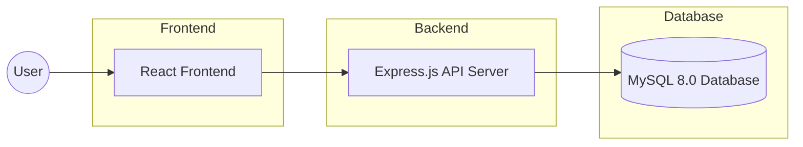
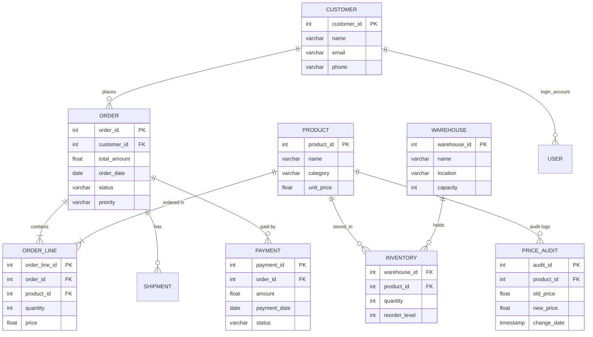
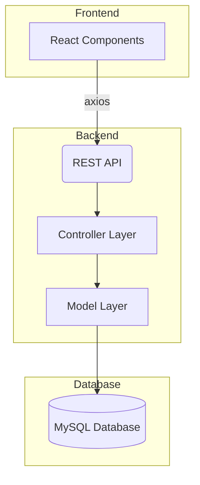

# 📦 Supply Chain Management System (SCMS)

## **A Full-Stack Inventory, Order, and Warehouse Management Platform**

The **Supply Chain Management System (SCMS)** is a comprehensive enterprise solution developed for the
**UE23CS351A – Database Management Systems Mini Project**.
It integrates **React**, **Node.js**, and **MySQL 8.0** to deliver a complete SCM workflow:

* Product & Inventory Management
* Order Processing & Fulfillment
* Warehouse Utilization Monitoring
* Real-Time Dashboards
* RBAC-based Secure Login
* End-to-End CRUD Operations

This system is engineered with full support for **Triggers, Stored Procedures, Views, UDFs, and Events**—ensuring a robust backend that demonstrates expert-level DBMS knowledge.

---

## 🖼️ System Architecture (High-Level)



---

## 🗂️ Entity Relationship Diagram (ERD)

**This ERD represents your final database schema including customers, orders, products, warehouses, inventory, payments & audits.**



---

## 🧑‍💻 UML Component Overview



---

## 🖼️ Screenshots (Add After Taking Images)

Place your screenshots in `/docs/screenshots` and reference them here.

---

### 📌 Login Page


### 📌 Dashboard Overview


### 📌 Inventory Page


### 📌 Price Audit Log


### 📌 Order Management


---

## 🚀 Key Features

### ✔ Complete Full-Stack Architecture

* React + Tailwind
* Node.js + Express
* MySQL 8.0 with triggers, procedures, functions

### ✔ Real-Time Dashboard

* Revenue charts
* Order trends
* Top customers/products
* Warehouse utilization

### ✔ Advanced MySQL Concepts

* **Triggers** (price change tracking, inventory update)
* **Stored Procedures** (transactional order creation)
* **Views** (summary reporting)
* **UDFs** (VIP status, warehouse utilization)
* **Events** (stock checks)

### ✔ Secure RBAC Authentication

* JWT tokens
* Hashed passwords
* Multi-role login

---

## 📦 Dependencies & Cross-Platform Installation Guide

Works on:

* Windows
* Ubuntu / Debian
* macOS
* GitHub Codespaces
* WSL

## Required Versions

| Tool         | Version |
| ------------ | ------- |
| Node.js      | 18+     |
| npm          | 8+      |
| MySQL Server | 8.0+    |
| Git          | Latest  |

---

## 🛠️ Backend Dependencies (server/)

```text
bcryptjs  
cors  
dotenv  
express  
jsonwebtoken  
mysql2  
validator  
nodemon (dev)
```

Install:

```bash
cd server
npm install
```

---

## 🎨 Frontend Dependencies (client/)

```text
axios  
react  
react-dom  
react-router-dom  
chart.js  
react-chartjs-2  
tailwindcss  
@heroicons/react
```

Install:

```bash
cd client
npm install
```

---

## 🧰 MySQL Installation (Cross-Platform)

### Ubuntu / Debian

```bash
sudo apt update
sudo apt install mysql-server
```

### Windows

Download installer:
[https://dev.mysql.com/downloads/installer/](https://dev.mysql.com/downloads/installer/)

### macOS

```bash
brew install mysql
brew services start mysql
```

### GitHub Codespaces

```bash
sudo apt install mysql-server
```

---

## 🌐 Environment Variables (`server/.env`)

```text
DB_HOST=localhost
DB_USER=root
DB_PASSWORD=yourpassword
DB_NAME=scm_portal
JWT_SECRET=supersecretkey
```

---

## 🧱 Database Setup — Run in Exact Order

```bash
echo "--- PHASE 1: LOADING DATABASE STRUCTURE AND LOGIC ---"

sudo mysql -u root -p < database/sql_scripts/01_create_database.sql
sudo mysql -u root -p scm_portal < database/sql_scripts/02_create_tables.sql
sudo mysql -u root -p scm_portal < database/sql_scripts/03_create_indexes.sql

sudo mysql -u root -p scm_portal < database/functions/01_business_functions.sql
sudo mysql -u root -p scm_portal < database/procedures/01_order_procedures.sql
sudo mysql -u root -p scm_portal < database/triggers/01_inventory_triggers.sql
sudo mysql -u root -p scm_portal < database/views/04_create_views.sql
sudo mysql -u root -p scm_portal < database/events/05_create_events.sql

sudo mysql -u root -p scm_portal < database/sql_scripts/04_insert_sample_data.sql

echo "--- DATABASE SETUP COMPLETE ---"
```

---

## 🖥️ Running the Application

## Start Backend

```bash
cd server
npm run dev
```

## Start Frontend

```bash
cd client
npm start
```

---

## 🔒 Login Accounts (RBAC Demo)

| Role     | Username     | Password      |
| -------- | ------------ | ------------- |
| Admin    | admin        | DBMS@pesu2025 |
| Supplier | abc_supplier | DBMS@pesu2025 |
| Customer | rajesh.k     | DBMS@pesu2025 |

---

## 🎯 Viva Demonstration Checklist (100% Marks)

### 1️⃣ Trigger Demonstration — Price Audit Log

* Change product price → Trigger logs entry

### 2️⃣ Stored Procedure — Order Processing

* Add item to order → Stock decreases
* Order total recalculates

### 3️⃣ UDF Metrics

* Warehouse utilization (%)
* Customer lifetime value

---
